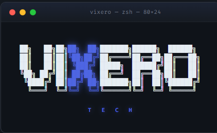

# vixero-skills



**Aggressive token-efficient Agent Skills for Claude.** Built to practice what they preach.

[](./LICENSE)
[](./skills/)

---

## Why this exists

The Agent Skills ecosystem exploded. Most skills in the wild are 1000–3000 tokens each — bloated with preamble, ceremonial politeness, redundant examples, and prose that should be tables. Every one of them loads into context competing for attention, and every one of them costs you.

**vixero-skills** is a curated set of agent skills built to practice what they preach: lean where lean is honest, rich where richness earns its keep.

> If a skill does not practice what it preaches, it shouldn't preach.

## Install

Download the repo, then in Claude.ai:

```
Settings → Features → Skills → Upload skill
```

Upload each folder from `skills/` as a separate zip. Or use them in Claude Code by placing the folders in `~/.claude/skills/`.

---

## The Pillar 1 bundle — token efficiency meta-skills

Meta-skills for auditing, compressing, and composing other skills. Every skill under 650 tokens.

| Skill | Purpose | Top-level tokens¹ |
|-------|---------|--------------------|
| [token-audit](./skills/token-audit/) | Score a SKILL.md for waste across 6 axes | ~520 |
| [skill-compress](./skills/skill-compress/) | Rewrite verbose skills into lean form | ~560 |
| [lean-response](./skills/lean-response/) | Session-wide response compression | ~530 |
| [description-craft](./skills/description-craft/) | Fix frontmatter descriptions that don't trigger | ~620 |
| [skill-graph](./skills/skill-graph/) | Map conflicts, redundancy, composition across a collection | ~650 |
| [token-budget-check](./skills/token-budget-check/) | Pre-flight a prompt before sending | ~590 |

**Total bundle: ~3,470 tokens for six skills.** Many single skills in competing repos exceed this.

---

## The Pillar 1.5 bundle — coding discipline (karpathy-derived)

Behavioral overlay + four focused audit skills for LLM-assisted coding. Derived from [Andrej Karpathy's observations](https://x.com/karpathy/status/2015883857489522876) on LLM coding pitfalls, rewritten in vixero style.

| Skill | Purpose | Top-level tokens¹ |
|-------|---------|--------------------|
| [karpathy-coding](./skills/karpathy-coding/) | Behavioral overlay for all coding tasks — four gates | ~1020 |
| [assumption-surface](./skills/assumption-surface/) | Extract hidden assumptions before work starts | ~1095 |
| [surgical-diff](./skills/surgical-diff/) | Review diffs for scope creep and style drift | ~1055 |
| [simplicity-audit](./skills/simplicity-audit/) | Flag premature abstraction and overengineering | ~1095 |
| [goal-criteria](./skills/goal-criteria/) | Transform vague tasks into verifiable goals | ~1260 |

**Umbrella vs focused.** `karpathy-coding` fires automatically on any coding task. The other four are deliberate audit tools you invoke on artifacts.

---

## The Pillar 1.7 bundle — council orchestration

Multi-lens review for high-stakes decisions. Six independent lenses + synthesizing judge. Anti-groupthink by protocol.

| Skill | Purpose | Top-level tokens¹ |
|-------|---------|--------------------|
| [vixero-council](./skills/vixero-council/) | Convene 6-lens council with judge synthesis | ~1030 |

**Progressive disclosure.** Council convening loads ~3,400 tokens across 7 files on demand. Trigger-scan pays ~1,030. Turns without council fire pay 0.

The six lenses: correctness 🎯 · adversary 🗡️ · maintainer 🔧 · performance 🔥 · integration 🧩 · contrarian 🎭

---

¹ Approximated at 4 chars / token. Real tokenization is often ~15% lower. Run `token-audit` on each skill for verified numbers.

## Usage patterns

**Auditing a skill:**
> "Audit this SKILL.md for token waste"  →  `token-audit` fires.

**Compressing after audit:**
> "Apply the cuts"  →  `skill-compress` fires with the audit output.

**Session-wide:**
> "Lean mode" at the start of a session  →  `lean-response` activates, no preamble for the rest of the session.

**Collection health check:**
> Paste multiple SKILL.md files, ask "do these overlap"  →  `skill-graph` fires.

**Before sending an expensive prompt:**
> "Pre-flight this prompt: {...}"  →  `token-budget-check` fires.

**Coding task (automatic):**
> any code request  →  `karpathy-coding` fires as behavioral overlay.

**Before a high-stakes commit:**
> "Convene council"  →  `vixero-council` fires, six lenses review, judge synthesizes verdict.

## Composition chains

```
token-budget-check → (rewrite) → send prompt
token-audit → skill-compress → updated SKILL.md
skill-graph → (reveals redundancy) → skill-compress on the loser
description-craft → (any new skill before first ship)

assumption-surface → goal-criteria → karpathy-coding → surgical-diff
simplicity-audit → (worst offender) → surgical-diff → apply fix
surgical-diff · simplicity-audit → pre-filter → vixero-council
vixero-council → (recommends changes) → karpathy-coding
```

## Design principles

Every skill in this repo follows these rules. Contributions must follow them too.

1. **Imperative voice only.** "Do X." Not "You should do X." Not "It is recommended that X be performed."
2. **Tables over prose** when information has >3 parallel items.
3. **One skill, one job.** Multi-purpose skills fire on the wrong tasks.
4. **Description is the load-gate.** See [description-craft](./skills/description-craft/SKILL.md).
5. **Hard rules are non-negotiable.** Guidance is negotiable; hard rules override.
6. **No emotional padding.** "Please", "kindly", "feel free" — deleted.
7. **No meta-narration.** Do not announce you are doing the thing. Just do it.
8. **Token budget by pillar.** Pillar 1: ≤650 tokens. Pillar 1.5: ≤1300 tokens. Pillar 1.7: progressive disclosure, load-gate ≤1100 tokens.

## Roadmap

- **Pillar 1** — Token efficiency meta-skills ✅
- **Pillar 1.5** — Coding discipline skills (karpathy-derived) ✅
- **Pillar 1.7** — Council orchestration ✅
- **Pillar 2** — Security & NIDS skills (companion to [pcap2tensor](https://github.com/Vix0007/pcap2tensor) and [arXiv:2604.02149](https://arxiv.org/abs/2604.02149))
- **Pillar 3** — Student & research workflow skills
- **Pillar 4** — ASEAN / Malaysia regional skills

## Contributing

Open a PR. Every new skill must:

1. Pass its own `token-audit` at score ≥ 75.
2. Have a frontmatter description that passes `description-craft`.
3. Declare its pillar and token count in the skill's README.
4. Pillar 1: ≤650 tokens at top level. Pillar 1.5+: justify the budget.

## Citation

If you use vixero-skills in research or tooling, attribution is appreciated:

```
vixero-skills (2026). Aggressive token-efficient Agent Skills for Claude.
Vickson Ferrel, Vixero Technology Enterprise.
https://github.com/Vix0007/vixero-skills
```

## License

MIT © Vickson Ferrel — [Vixero Technology Enterprise](https://vixdev.cloud)

---

**Built in Sarawak. For humans who pay for tokens.** 🛡️
